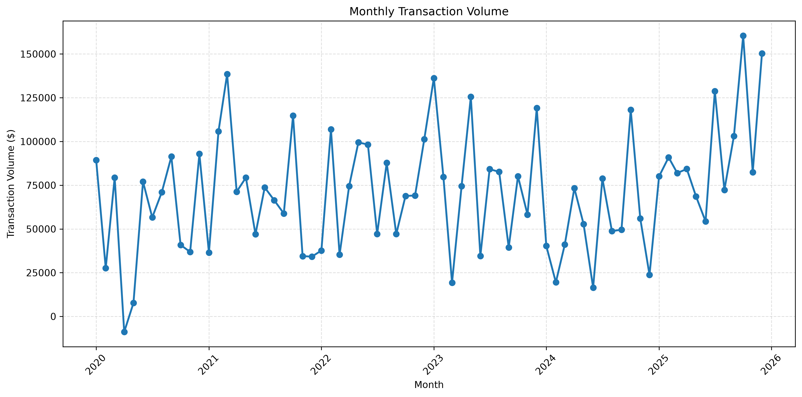
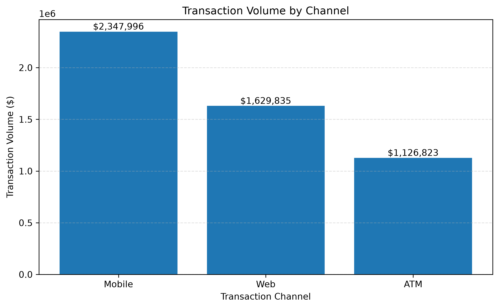
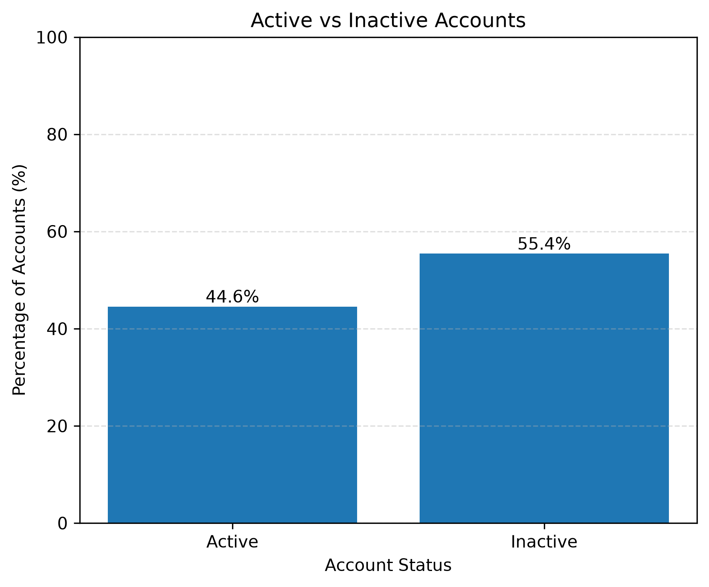

# 📊 Banking Transactions Analytics

Business Intelligence • SQL • Python • Pandas • PostgreSQL • Data Visualization

A data analytics project focused on exploring banking transaction data to uncover business insights related to customer behavior, regional performance, product usage, transaction channels, and operational efficiency.

The project combines **SQL**, **Python**, **Pandas**, and **Matplotlib** to answer real-world business questions through data analysis and visualization.

---

# 🚀 Technologies Used

- PostgreSQL
- SQL
- SQLAlchemy
- Python
- Pandas
- Matplotlib
- Jupyter Notebook

---

# 📁 Project Structure

```text
banking-transactions-analytics/

├── data/
│   ├── raw/
│   └── processed/
│
├── notebooks/
│   └── 01_business_analysis.ipynb
│
├── sql/
│   ├── 01_create_tables.sql
│   ├── 02_import_data.sql
│   └── 03_business_queries.sql
│
├── images/
│
├── requirements.txt
│
└── README.md
```

---

# 🎯 Project Objectives

The objective of this project is to analyze banking transaction data to answer business-oriented questions such as:

- Which regions generate the highest transaction volume?
- How are customers distributed across regions?
- Which banking products contribute the most to transaction volume?
- How does transaction activity evolve over time?
- Which transaction channels are preferred by customers?
- What percentage of customer accounts remain active?
- Are transaction failures concentrated in a specific product category?

---

# 📈 Business Analysis

The notebook contains eight business KPIs covering multiple analytical perspectives:

| Category | KPI |
|-----------|-----|
| Regional Analysis | Successful Transaction Volume by Region |
| Regional Analysis | Customer Distribution by Region |
| Product Analysis | Transaction Volume by Product Category |
| Time Analysis | Monthly Transaction Volume |
| Channel Analysis | Transaction Volume by Channel |
| Account Analysis | Average Balance by Account Type |
| Account Analysis | Active Accounts Percentage |
| Operational Analysis | Failed Transactions by Product Category |

---

# 📷 Sample Visualizations

### Transaction Volume by Region


---

### Monthly Transaction Volume



---

### Transaction Volume by Channel



---

### Active Accounts



---

# 💡 Key Insights

- Colorado generated the highest transaction volume despite not having the largest customer base.
- Product categories contributed relatively balanced transaction volumes.
- Mobile banking was the most frequently used transaction channel.
- Only **44.56%** of customer accounts were active, suggesting an opportunity to improve customer engagement.
- Failed transactions were evenly distributed across product categories, indicating no product-specific operational issues.

---

# ▶️ How to Run

Clone the repository:

```bash
git clone https://github.com/your_username/banking-transactions-analytics.git
```

Install the required packages:

```bash
pip install -r requirements.txt
```

Open the notebook:

```bash
jupyter notebook
```

Run the notebook sequentially to reproduce the analysis.

---

# 👤 Author

**Adrián Segura Santillán**

Physics Engineer | Data Analytics | SQL | Python | Machine Learning

