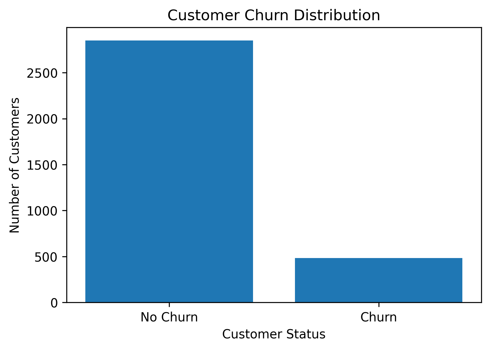
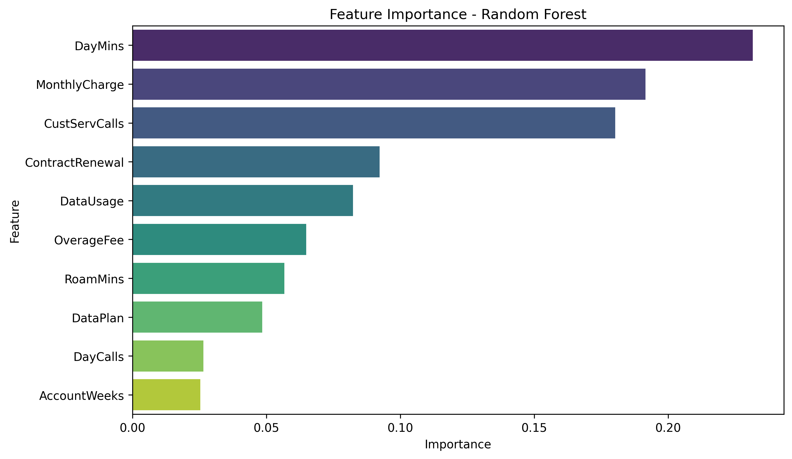

# 📉 Customer Churn Prediction using Machine Learning

Predicting customer churn is one of the most important applications of machine learning in customer relationship management. In this project, multiple classification algorithms are developed and compared to identify customers who are likely to leave a telecommunications company.

The project follows a complete data science workflow, including exploratory data analysis, data preprocessing, model development, model evaluation, feature importance analysis, and business recommendations.

---

## 📌 Business Problem

Customer acquisition is typically more expensive than customer retention. Being able to identify customers who are at risk of leaving enables companies to implement targeted retention strategies, reduce churn, and increase customer lifetime value.

The objective of this project is to build and compare machine learning models capable of predicting customer churn based on customer usage patterns, billing information, and service-related variables.

---

## 📊 Dataset

The dataset contains customer information from a telecommunications company.

**Number of observations:** 3,333 customers

### Features

- AccountWeeks
- ContractRenewal
- DataPlan
- DataUsage
- CustServCalls
- DayMins
- DayCalls
- MonthlyCharge
- OverageFee
- RoamMins

**Target variable**

- Churn

---

## 🔄 Project Workflow

```

Load Dataset
↓
Exploratory Data Analysis (EDA)
↓
Data Preprocessing
↓
Model Development
↓
Model Comparison
↓
Feature Importance
↓
Business Recommendations

```

---

## 📈 Exploratory Data Analysis

### Churn Distribution

<p align="center">

</p>

The exploratory analysis focused on understanding customer behavior and identifying variables associated with churn.

The analysis revealed that:

- Customers without contract renewals are considerably more likely to churn.
- Customers making more customer service calls exhibit higher churn rates.
- Higher daytime usage and monthly charges are associated with increased churn.
- Variables such as Account Weeks and Day Calls show relatively weak relationships with churn.

---

## 🤖 Machine Learning Models

The following classification algorithms were trained and evaluated:

- Logistic Regression
- Decision Tree
- Random Forest
- K-Nearest Neighbors (KNN)

---

## 🏆 Model Performance

| Model | Accuracy | Precision | Recall | F1-score | ROC-AUC |
|:----------------------|---------:|----------:|--------:|---------:|---------:|
| Logistic Regression | 0.858 | 0.526 | 0.206 | 0.296 | 0.809 |
| Decision Tree | 0.892 | 0.640 | 0.588 | 0.613 | 0.766 |
| **Random Forest** | **0.927** | **0.833** | **0.619** | **0.710** | **0.858** |
| K-Nearest Neighbors | 0.880 | 0.644 | 0.392 | 0.487 | 0.811 |

Random Forest achieved the best overall predictive performance and was selected as the final model.

---

## 📌 Feature Importance

<p align="center">

</p>

The Random Forest model identified the following variables as the most influential predictors of customer churn:

1. Day Minutes
2. Monthly Charge
3. Customer Service Calls
4. Contract Renewal

These findings suggest that customer usage behavior, billing characteristics, and service interactions play an important role in predicting churn.

---

## 💼 Business Recommendations

Based on the analysis, several business actions are recommended:

- Prioritize retention campaigns for customers who have not renewed their contracts.
- Monitor customers with high daytime usage and monthly charges.
- Improve customer service processes to reduce repeated support calls.
- Deploy the trained model to identify high-risk customers before they churn.
- Retrain the model periodically as customer behavior evolves.

---

## 🛠 Technologies Used

- Python
- Pandas
- NumPy
- Matplotlib
- Seaborn
- Scikit-learn
- Jupyter Notebook

---

## 📁 Repository Structure

```

customer-churn-prediction/
│
├── data/
│   └── telecom_churn.csv
│
├── notebooks/
│   └── customer_churn_prediction.ipynb
│
├── images/
│
├── README.md
├── requirements.txt
├── .gitignore
└── LICENSE

```

---

## 🚀 Getting Started

Clone the repository:

```bash
git clone https://github.com/your_username/customer-churn-prediction.git
```

Navigate to the project:

```bash
cd customer-churn-prediction
```

Install the dependencies:

```bash
pip install -r requirements.txt
```

Launch Jupyter Notebook:

```bash
jupyter notebook
```

---

## 🔮 Future Improvements

Potential extensions of this project include:

- Hyperparameter optimization using GridSearchCV
- Cross-validation
- XGBoost and LightGBM implementation
- Model deployment using Streamlit or Flask
- Automated model retraining
- Explainability with SHAP values

---

## 👨‍💻 Author

**Adrián Segura Santillán**

Physics Engineer | Data Science | Machine Learning

