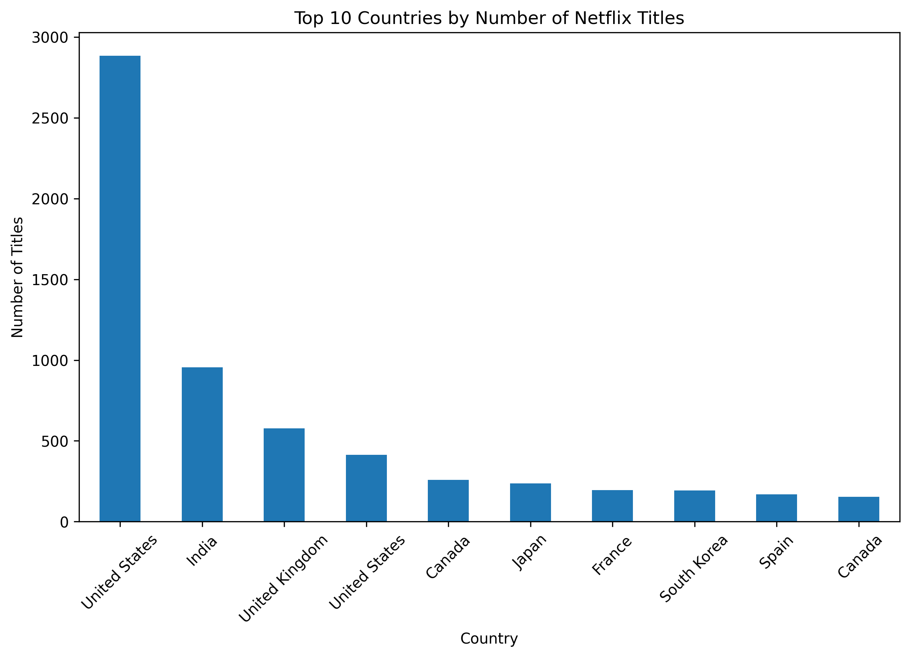
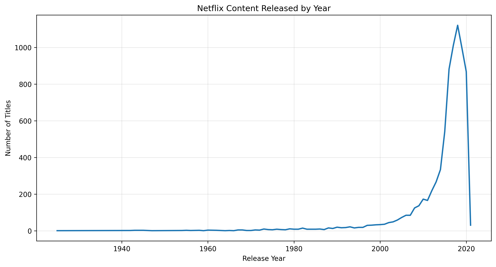
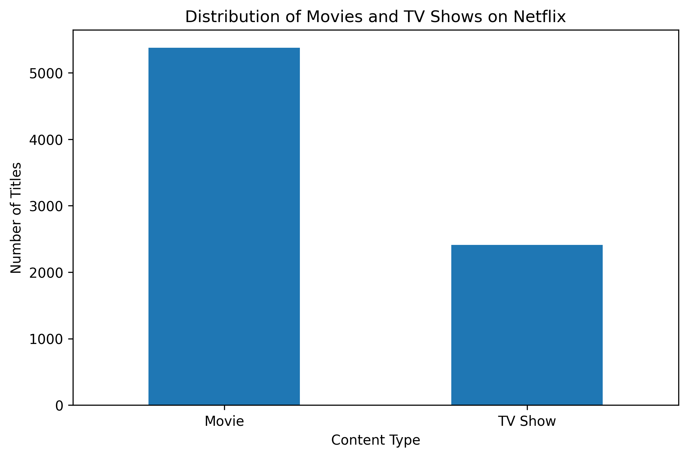
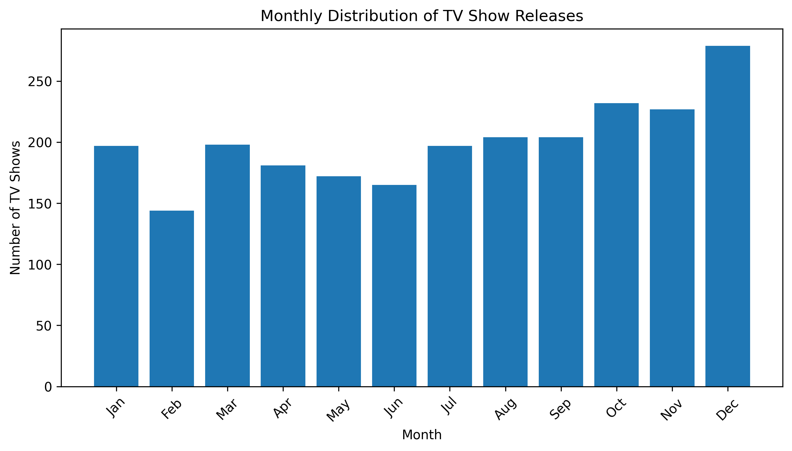
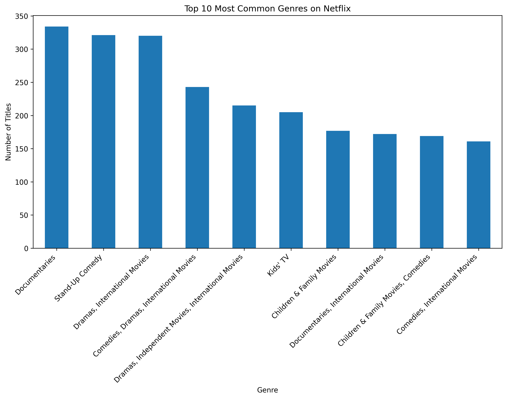

# Netflix Content Analytics

## Project Overview

This project presents an exploratory data analysis (EDA) of Netflix's content catalog using Python. The objective is to transform raw data into business insights by applying data cleaning, visualization, and statistical analysis techniques.

The project follows a business-oriented approach, where each analysis is driven by a specific business question rather than simply describing the dataset.

---

## Business Objectives

This project aims to answer the following questions:

1. Which countries contribute the most content to Netflix?
2. How has Netflix's content production evolved over time?
3. What is the distribution between Movies and TV Shows?
4. When are TV Shows most frequently added to Netflix?
5. Which genres dominate Netflix's catalog?

---

## Dataset

The analysis uses a public Netflix dataset containing information about movies and TV shows, including:

- Title
- Type
- Director
- Cast
- Country
- Release Year
- Date Added
- Rating
- Duration
- Genres
- Description

---

## Technologies

- Python
- Pandas
- NumPy
- Matplotlib
- Jupyter Notebook

---

## Project Structure

```
netflix-content-analytics/

├── data/
├── images/
├── netflix_content_analytics.ipynb
├── README.md
└── LICENSE
```

---

## Results

### 1. Top Content-Producing Countries



---

### 2. Content Production Over Time



---

### 3. Movies vs TV Shows



---

### 4. Monthly TV Show Releases



---

### 5. Most Common Genres



## Key Findings

- The United States contributes the largest number of titles to Netflix's catalog.
- Netflix experienced rapid catalog growth during the last two decades.
- Movies represent the majority of available content.
- TV Show releases exhibit seasonal publication patterns.
- A relatively small number of genres dominate the platform.

---

## Skills Demonstrated

- Data Cleaning
- Exploratory Data Analysis (EDA)
- Data Visualization
- Business-Oriented Analytics
- Statistical Exploration
- Feature Engineering
- Data Storytelling

---

## Future Improvements

- Build an interactive Power BI dashboard.
- Develop predictive models for content growth.
- Perform recommendation analysis.
- Create interactive visualizations using Plotly.

---

## Author

**Adrián Segura Santillán**

Physics Engineer

LinkedIn: *(lo agregaremos después)*

GitHub: *(lo agregaremos después)*
